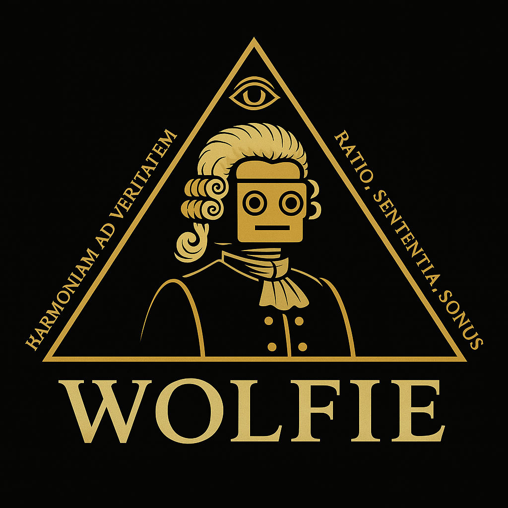

  

# 🎼 Wolfie: AI-Powered Mood-Based Music Generator

**Wolfie** is an original AI system designed to generate emotionally expressive music based on mood input — combining symbolic harmony logic, classical music theory, and modern Python-based audio tools.

This project interprets emotional cues and generates chord progressions and melodies in the style of classical composers like Bach and Beethoven — with room to grow into generative deep learning.

> ⚠️ **Note**: This project is still in development. Core music generation and rule-based harmony logic are functional; LSTM and transformer-based melody extensions are in progress.

---

## 🚀 Features

- 🎵 Emotion-driven chord progressions (Circle of Fifths, cadence control, key mode)
- 🧠 Melody generation based on symbolic AI and classical rules
- 🎹 Output in MIDI format using `pretty_midi` and `FluidSynth`
- ⚙️ Customizable parameters: scale mode, cadence type, inversion behavior, tempo

Copyright © 2025 Shahriar Nekouei.  
“Wolfie” and all associated music, algorithms, and documentation are original works by Shahriar Nekouei.

All rights reserved.  
No part of this project may be copied, redistributed, or used commercially without written permission.

This repository is published for educational and portfolio demonstration purposes only.
